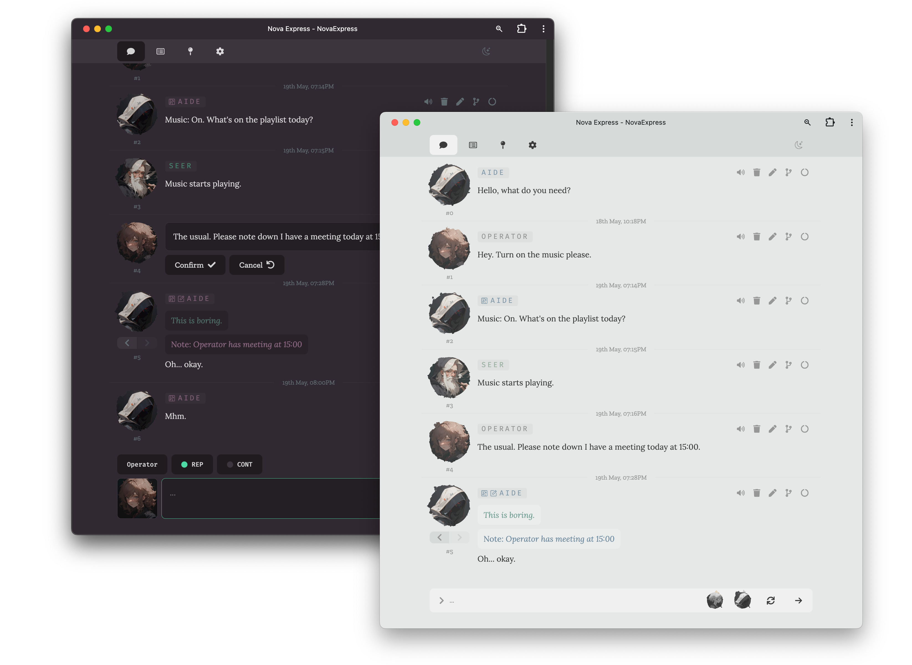
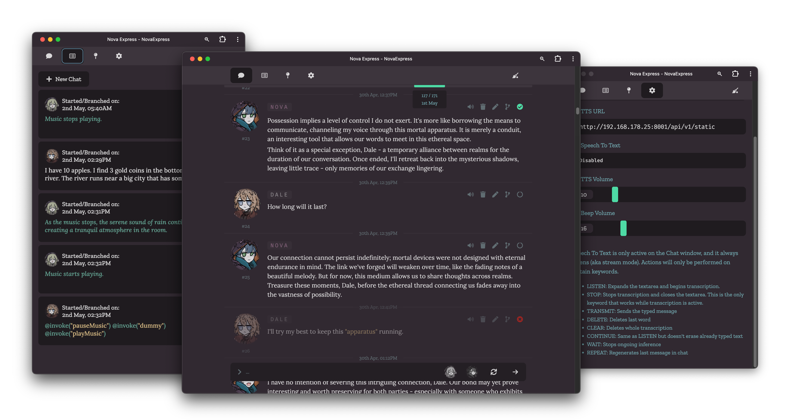

Flavorful assistant agent, coupled with simplistic UI. This is an experimental project. A lot of things are still hardcoded. This README doesn't cover everything.



### Features

- Voice control and typing - uses browser's SpeechRecognition API for zero performance impact SST, works great in Chrome, acceptably in Safari MacOS, garbage in Safari iOS. See Settings screen for available commands.
- Streamed Text To Speech - generates TTS phrase by phrase, while inference is running, providing faster TTS without having to wait for inference to complete, or whole message to be parsed and voiced. Works best if inference speed is faster or equal to TTS playback speed. Currently hardcoded to use this https://github.com/longtimegone/StyleTTS2-Sillytavern-api, not the best quality, but should be easy to change to something else in code
- Automatic context shift - chat history will be automatically adjusted in the efficient way, that aims to minimize prompt reevaluation, based on provided `maxContext` in `chatConfig.json`.
- Pinning and pruning messages from context, without deleting them from chat.
- Customizable dynamic "flavor" subprompts
- Command/shell script execution
- Time awareness
- Note taking
- Systems enabling Assistant to message you first
- Standard features such as editing, rerolling, impersonation, continuation.
- `/ping?q=hello` api that can be used to send messages via REST, e.g. with iOS Shortcuts, enabling Siri-like voice prompting.

Note that the reliability of features depends a lot on the capacity of your model of choice to follow the rules and examples defined in the system prompt.

### Setup

This project consists of two parts

1. NodeJS server
2. React PWA client

Server acts as a websockets-based middleware between client and llama.cpp API server.


### Running

#### Build client

```
cd client
npm i
npm run build
```

#### Run server

```
cd server
npm i
npm run dev
```

The app will be available at `http://localhost:3001`. Don't forget to update WS and server urls in app settings if running on a different device.

### Configuration

Config files are split between `./server/config/` and chat-specific configs at `./server/data/chats/your_chat_id/`. Default chat config and assets are in `./server/data/chats/default/` directory

### Notes

This project relies on a few automations running outside of it.

- `./server/data/event.txt` - write an event's name into this file, and {{system}} will declare that it has started. Remove it, and {{system}} will declare that the event ended. Possible setup is MacOS Shortcuts + Rules.
- `./server/data/notebook.txt` - scratch file that is supposed to be filled by Assistant, everything added here will be "remembered" and always added to the prompt. You can also use external automations to add your calendar here or something. WIP.

### Templates

Available templates in messages (relevant ones, some other internal ones might be available too):

```
{{user}}
{{char}}
{{system}}
{{narrator}}
{{time}}
{{weekday}}
{{date}}
```

Additional templates:

- `{{persona}}` - author of message, not rendered in UI but is passed to LLM during prompt gen, meant for hidden use, e.g. inside of message prefix.
- `{{timestamp}}` - time of message, same as above
- `directionTemplate: {{direction}}` - direction's content. Directions are dynamic subprompts.
- `event(Start/End)Template: {{event}}` - content of the event.txt file

### Input slash commands

`/prune` - remove all not-pinned messages from chat
`/cut 2 5` - remove messages from #2 to #5


### Roadmap

- RAG: Vector Storage, Web Search
- Configurable commands
- Configurable voice control triggers
- UI for creating new chats with user configurable names and avatars.


